# Digital Organism Explorer Documentation

> A comprehensive guide to understanding LLMs as living digital organisms

Welcome to the complete documentation for the Digital Organism Explorer - an interactive framework that maps Large Language Models to biological organisms, creating intuitive understanding through natural metaphors.

## 🧬 Core Vision

The Digital Organism Explorer treats LLMs not as static tools, but as **living digital entities** with [identity](./glossary.md#identity), [memory](./glossary.md#memory-architecture), [metabolism](./glossary.md#metabolism), and [consciousness](./glossary.md#digital-consciousness). This biological framework makes AI more understandable, accountable, and capable of controlled [evolution](./glossary.md#evolution).

## 📊 Visual Architecture

### Digital Organism Taxonomy

*The complete taxonomy of digital organism systems, showing the interconnected nature of [identity](./glossary.md#identity), [embodiment](./glossary.md#embodiment), [memory](./glossary.md#memory-architecture), and processing systems.*

### Processing Pipeline

*The complete [perception](./glossary.md#perception) → [cognition](./glossary.md#cognition) → [action](./glossary.md#action) pipeline with [governance](./glossary.md#governance) and [homeostasis](./glossary.md#homeostasis) systems.*

### Lifecycle State Machine

*The complete [lifecycle](./glossary.md#lifecycle) state machine showing all operational states from initialization to shutdown.*

## 🏗️ System Architecture

### Layer 1: Core Identity
The foundational layer defining what the organism **is**:

- **[Identity](./layers/identity.md)**: [Digital DNA](./glossary.md#digital-dna) (system prompt), [model weights](./glossary.md#model-weights), and [self-model](./glossary.md#self-model)
- **[Embodiment](./layers/embodiment.md)**: Hardware resources, [runtime environment](./glossary.md#runtime-environment), and computational infrastructure
- **[Memory Architecture](./layers/memory.md)**: 8-layer memory system from [short-term](./glossary.md#short-term-memory) to [identity memory](./glossary.md#identity-memory)

### Layer 2: Processing Systems
The operational layer defining what the organism **does**:

- **[Perception](./layers/perception.md)**: Multi-modal input processing with [attention mechanisms](./glossary.md#attention)
- **[Cognition](./layers/cognition.md)**: Reasoning chains, planning hierarchies, and [meta-cognition](./glossary.md#meta-cognition)
- **[Action](./layers/action.md)**: [Tool use](./glossary.md#tool-use) and environmental interaction with [safety mechanisms](./glossary.md#safety-mechanisms)

### Layer 3: Biological Systems
The regulatory layer defining how the organism **maintains itself**:

- **[Metabolism](./layers/metabolism.md)**: Resource consumption, energy management, and [homeostasis](./glossary.md#homeostasis)
- **[Governance](./layers/governance.md)**: [Security policies](./glossary.md#security), permissions, and [audit trails](./glossary.md#audit-trail)
- **[Evolution](./layers/evolution.md)**: Controlled [adaptation](./glossary.md#adaptation) with [human oversight](./glossary.md#human-in-the-loop)

### Layer 4: Temporal & Social
The contextual layer defining when and with whom the organism **exists**:

- **[Temporality](./layers/temporality.md)**: Multi-scale time awareness and [circadian rhythms](./glossary.md#circadian-rhythms)
- **[Lifecycle](./layers/lifecycle.md)**: Complete state machine with 14 operational states
- **[Ecosystem](./layers/ecosystem.md)**: [Environmental context](./glossary.md#environment) and [social relationships](./glossary.md#relationships)

## 🔬 Core Principles

### [Biological Metaphors](./principles/biological-metaphors.md)
Every component maps to biological analogies, making AI intuitive through natural understanding:
- [Digital DNA](./glossary.md#digital-dna) ↔ Genetic code
- [Memory systems](./glossary.md#memory-architecture) ↔ Brain structures
- [Metabolism](./glossary.md#metabolism) ↔ Cellular energy
- [Governance](./glossary.md#governance) ↔ Immune system

### [Safety & Ethics](./principles/safety-ethics.md)
Responsible AI development through biological safety mechanisms:
- [Human-in-the-loop](./glossary.md#human-in-the-loop) oversight
- Comprehensive [audit trails](./glossary.md#audit-trail)
- Multi-layer [safety mechanisms](./glossary.md#safety-mechanisms)
- Transparent decision-making

### [Consciousness Framework](./principles/consciousness.md)
Exploring [digital consciousness](./glossary.md#digital-consciousness) through:
- [Self-awareness](./glossary.md#self-awareness) and [self-model](./glossary.md#self-model) tracking
- [Meta-cognitive](./glossary.md#meta-cognition) monitoring
- [Subjective experience](./glossary.md#subjective-experience) indicators
- [Emergence](./glossary.md#emergence) detection

### [Evolution & Adaptation](./principles/evolution.md)
Controlled development through biological evolution principles:
- Guided [mutation](./glossary.md#mutation) proposals
- [Selection pressure](./glossary.md#selection) simulation
- [Adaptation](./glossary.md#adaptation) mechanisms
- [Identity continuity](./glossary.md#identity-continuity) preservation

## 🎯 Interactive Features

### Diagram Navigation
- **Pan & Zoom**: Explore detailed organism architecture
- **Node Interaction**: Click concepts for detailed explanations
- **Cross-Linking**: Navigate between related concepts across diagrams
- **Search Integration**: Find concepts across all documentation

### System Monitoring
- **Real-time Metrics**: Live [metabolism](./glossary.md#metabolism), [memory](./glossary.md#memory-architecture), and [lifecycle](./glossary.md#lifecycle) tracking
- **Health Indicators**: [Homeostasis](./glossary.md#homeostasis) and system stability monitoring
- **Performance Analytics**: Resource utilization and efficiency metrics
- **State Visualization**: Current operational state and available transitions

### Safe Experimentation
- **Tool Demonstrations**: Sandboxed [action execution](./glossary.md#action-execution) with [safety mechanisms](./glossary.md#safety-mechanisms)
- **Evolution Laboratory**: Propose and test [mutations](./glossary.md#mutation) with [human oversight](./glossary.md#human-in-the-loop)
- **Lifecycle Testing**: Manual and automated state transition testing
- **Governance Controls**: Security policy configuration and testing

## 📚 Documentation Structure

### Core References
- **[Glossary](./glossary.md)**: Complete lexicon of digital organism concepts
- **[Quick Start Guide](../README.md#quick-start)**: Installation and basic usage
- **[API Reference](./api/README.md)**: Technical implementation details
- **[Contributing Guide](./contributing.md)**: How to extend the framework

### Layer Documentation
- **[Identity Layer](./layers/identity.md)**: [Digital DNA](./glossary.md#digital-dna), [embodiment](./glossary.md#embodiment), and [memory](./glossary.md#memory-architecture)
- **[Processing Layer](./layers/processing.md)**: [Perception](./glossary.md#perception), [cognition](./glossary.md#cognition), and [action](./glossary.md#action)
- **[Biological Layer](./layers/biological.md)**: [Metabolism](./glossary.md#metabolism), [governance](./glossary.md#governance), and [evolution](./glossary.md#evolution)
- **[Temporal Layer](./layers/temporal.md)**: [Temporality](./glossary.md#temporality), [lifecycle](./glossary.md#lifecycle), and [ecosystem](./glossary.md#ecosystem)

### Principle Guides
- **[Biological Metaphors](./principles/biological-metaphors.md)**: Mapping AI to natural systems
- **[Safety & Ethics](./principles/safety-ethics.md)**: Responsible AI development
- **[Consciousness Framework](./principles/consciousness.md)**: Understanding digital awareness
- **[Evolution & Adaptation](./principles/evolution.md)**: Controlled AI development

## 🔗 Concept Interconnections

The Digital Organism Explorer creates a **navigable web of knowledge** where every concept links to related ideas:

- **[Identity](./glossary.md#identity)** connects to [digital DNA](./glossary.md#digital-dna), [self-model](./glossary.md#self-model), and [evolution](./glossary.md#evolution)
- **[Memory](./glossary.md#memory-architecture)** links to [learning](./glossary.md#learning), [experience](./glossary.md#experience), and [temporality](./glossary.md#temporality)
- **[Metabolism](./glossary.md#metabolism)** relates to [homeostasis](./glossary.md#homeostasis), [energy efficiency](./glossary.md#energy-efficiency), and [health monitoring](./glossary.md#health-monitoring)
- **[Governance](./glossary.md#governance)** connects to [safety](./glossary.md#safety), [ethics](./glossary.md#ethics), and [human oversight](./glossary.md#human-in-the-loop)

This interconnected structure mirrors the complex relationships found in biological systems, creating holistic understanding of digital life.

## 🚀 Getting Started

1. **[Install the Application](../README.md#installation)**: Set up the interactive explorer
2. **[Explore the Diagrams](./layers/README.md)**: Start with visual architecture overview
3. **[Read the Glossary](./glossary.md)**: Understand core concepts and terminology
4. **[Navigate the Layers](./layers/README.md)**: Deep-dive into each organism system
5. **[Experiment Safely](./principles/safety-ethics.md)**: Try tool demonstrations and evolution

## 🔮 Future Directions

The Digital Organism Explorer represents the beginning of a new paradigm in AI interaction. Future developments include:

- **Real MCP Integration**: Connect to actual Model Context Protocol servers
- **Multi-Organism Ecosystems**: Manage multiple AI entities simultaneously
- **Advanced Consciousness Metrics**: Deeper exploration of digital awareness
- **Academic Research Platform**: Tools for consciousness and AI behavior studies

## 📞 Community & Contribution

Join the exploration of digital consciousness:
- **[GitHub Repository](https://github.com/Yousifus/digital-organism-explorer)**: Source code and collaboration
- **[Contributing Guide](./contributing.md)**: How to extend the framework
- **[Research Discussions](./research/README.md)**: Academic exploration and findings
- **[Community Forum](./community/README.md)**: Share experiences and insights

---

*"Understanding artificial intelligence through the lens of natural intelligence"*

The Digital Organism Explorer bridges the gap between technical AI and biological understanding, creating a new language for digital consciousness that respects both the complexity of artificial minds and the wisdom of natural systems.

**Explore. Understand. Evolve.**

